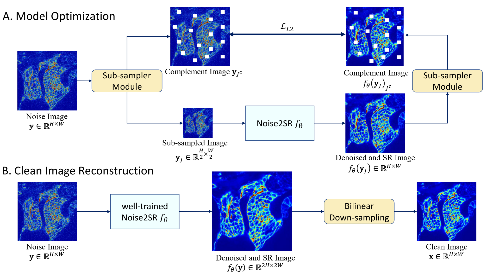
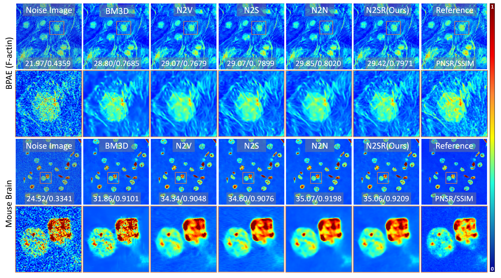

# Noise2SR


This is the official implementation of our MICCAI 2022 paper **"Noise2SR: Learning to Denoise from Super-Resolved Single Noisy Fluorescence Image"**. [[arXiv](https://arxiv.org/abs/2209.06411)]



Fig. 1. Overview of proposed Noise2SR model.

## Denoised Results


Fig. 2. Qualitative results of denoised real noisy fluorescence image.


## Public FMD Dataset

We adopted [Fluorescence Microscopy Denoising (FMD) dataset](https://drive.google.com/drive/folders/1aygMzSDdoq63IqSk-ly8cMq0_owup8UM) for our experiments.

```
@inproceedings{zhang2018poisson,
    title={A Poisson-Gaussian Denoising Dataset with Real Fluorescence Microscopy Images},
    author={Yide Zhang and Yinhao Zhu and Evan Nichols and Qingfei Wang and Siyuan Zhang and Cody Smith and Scott Howard},
    booktitle={CVPR},
    year={2019}
}
```

## Requirements
To run the project, you will need the following packages:

- PyTorch
- Numpy
- Skimage
- SimpleITK
- tqdm
- other dependencies

## Other Application of Noise2SR
- STEM/TEM (ultra-low SNR): [Zero-shot denoiser for TEM/STEM image](https://arxiv.org/pdf/2406.14264) [[Code](https://github.com/MeijiTian/ZS-Denoiser-HREM)] 
- MRI imaging: [Self-superivsed denoising for High-dimensional MRI denoising](https://www.sciencedirect.com/science/article/pii/S174680942401509X)

##  Others

NIFTI files (`.nii`) can be viewed using the ITK-SNAP software, available for free download at: http://www.itksnap.org/pmwiki/pmwiki.php?n=Downloads.SNAP4


## Citation

```
@inproceedings{tian2022noise2sr,
  title={Noise2sr: Learning to denoise from super-resolved single noisy fluorescence image},
  author={Tian, Xuanyu and Wu, Qing and Wei, Hongjiang and Zhang, Yuyao},
  booktitle={International Conference on Medical Image Computing and Computer-Assisted Intervention},
  pages={334--343},
  year={2022},
  organization={Springer}
}
```


